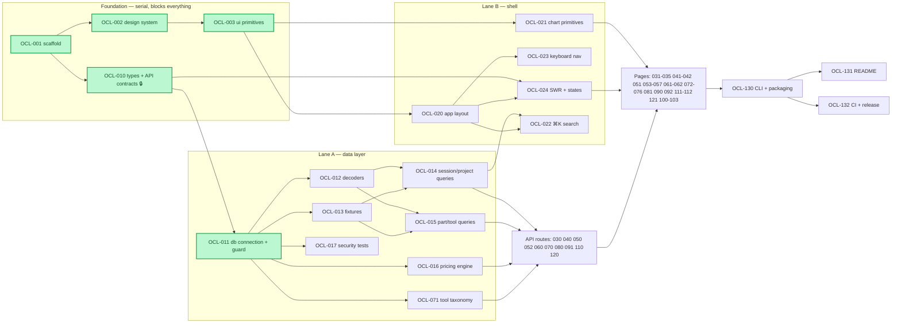

# oc-lens — development backlog

**Status:** v1 backlog, frozen 2026-08-01. **Audience:** the implementation agents (Sonnet swarm) and their reviewer.

---

## 0. How to use this backlog (read this first — it is binding)

1. **Take exactly one ticket.** Do not start a ticket whose `Depends on` tickets are not merged. Do not opportunistically fix things in another ticket's `Owns` files — open a follow-up ticket instead.
2. **`Owns` is a lock.** Every ticket lists the files it may create or modify. If your work requires touching a file another ticket owns, stop and escalate; two agents editing the same file in parallel is the single biggest failure mode of a swarm.
3. **`project-docs/opencode-data-model.md` is the only source of truth about opencode's data.** Do not infer shapes from memory. If a shape you need is marked ⚠️ UNVERIFIED there, your ticket has a probe step — run it and update that document as part of your PR.
4. **When the ticket is ambiguous about UI, read cc-lens.** A read-only reference checkout lives at `.reference/cc-lens` (upstream `github.com/Arindam200/cc-lens`, cloned at v0.4.1, gitignored). Ticket `Reference` fields cite exact paths in it. **cc-lens is a reference for information architecture, component structure and interaction design — never for data access.** Its entire reader layer (`lib/claude-reader.ts`, `lib/decode.ts`) is meaningless for opencode.
5. **Never copy cc-lens source verbatim.** It is MIT-licensed; attribution is in the README (OCL-131). Re-implement against our own types. Structural similarity is expected and fine; literal file copies are not.
6. **Definition of Done applies to every ticket** — see §5. A ticket is not done because the page renders; it is done when the acceptance criteria are individually demonstrable.

---

## 1. What oc-lens is

**A local-only, read-only analytics dashboard for opencode.** Point it at your machine, it reads `~/.local/share/opencode/opencode.db` and shows you what your agent has actually been doing: sessions, tokens, cost, tools, errors, agents, projects, activity over time, and full conversation replay.

**Why it exists.** opencode already ships `opencode web` (a web UI for driving sessions) and `opencode stats` (a terminal summary). Neither does history analytics: cost over time, streaks, per-project breakdowns, tool-error analysis, replay, subagent trees. **The analytics layer is the product.** oc-lens is not "a web UI for opencode" — that exists.

**Non-goals for v1 — do not build these:**

- Any write to opencode's database, config, or session files. oc-lens is strictly read-only against opencode. *(The one exception, precisely scoped: oc-lens writes its own config file at `~/.config/oc-lens/config.json` for user-entered model prices. Nothing else.)*
- An `AGENTS.md` editor, or any other file editor.
- Team/multi-user features, cloud sync, or telemetry.
- Driving opencode (starting sessions, sending prompts).
- The cc-lens pages that have no honest opencode data source — see §7 Annex A.

---

## 2. Locked decisions

These were decided by the maintainer on 2026-08-01. Do not relitigate them inside a ticket; raise a separate issue if you have evidence they are wrong.

| # | Decision | Rationale |
|---|---|---|
| D1 | **Read opencode's SQLite DB directly, read-only.** The HTTP API is used only for optional live health (OCL-112). | The product is aggregation over history — that is SQL's job. Keeps oc-lens working with opencode not running, which preserves the "point it at a folder and it works" property. |
| D2 | **Strictly read-only against opencode.** DB opened `readOnly: true`; no POST/PATCH/DELETE route touches opencode data. | One SQLite file holds the user's entire agent history. A write bug is unrecoverable. |
| D3 | **Cost = user-entered prices.** oc-lens ships a Settings screen where the user enters $ per 1M tokens (input / output / cache-read / cache-write) per `providerID/modelID`, and all cost figures are computed from that. Stored `cost` columns are shown only as a labelled comparison. | The maintainer's provider reports `cost: 0`, so any bundled pricing table would be both wrong and unmaintainable across arbitrary providers. User-entered prices are always correct for the user. |
| D4 | **All four opencode-native views ship in v1**: subagent tree, agent breakdown, skill analytics, file-change timeline. | They are the differentiator versus "opencode already has a web UI". |
| D5 | **Keep cc-lens's information architecture; reskin to an opencode identity.** Same page set, same component decomposition, own colour/type/logo. | Makes the port near-mechanical for a swarm without shipping a visual clone of someone else's product. |
| D6 | **Stack mirrors cc-lens**: Next.js 16 (App Router) · React 19 · TypeScript strict · Tailwind 4 · shadcn/ui · Recharts · SWR · Vitest. | Component ports become near-mechanical. Divergence costs more than it buys. |
| D7 | **SQLite driver is `node:sqlite` (`DatabaseSync`), not `better-sqlite3`.** | Zero native dependencies, so `npx oc-lens` needs no prebuild matrix. Requires Node ≥ 22.5 (`engines: >=22`). *Tradeoff:* a younger API than `better-sqlite3`; OCL-011 isolates it behind one module so swapping is a one-file change. |

---

## 3. Repo layout

```
oc-lens/
├── app/                      # Next.js App Router — pages + API routes
│   ├── api/…/route.ts
│   └── <page>/page.tsx
├── components/
│   ├── ui/                   # shadcn primitives          (OCL-003)
│   ├── layout/               # shell                      (OCL-020)
│   ├── charts/               # chart primitives           (OCL-021)
│   └── <feature>/            # feature components
├── lib/
│   ├── db/                   # connection, schema guard   (OCL-011)
│   ├── decode/               # JSON payload decoders      (OCL-012)
│   ├── queries/              # SQL aggregation modules    (OCL-014/015)
│   ├── pricing/              # price config + cost calc   (OCL-016)
│   └── tools/                # tool taxonomy + MCP        (OCL-071)
├── types/oc.ts               # domain types + API contracts (OCL-010, FROZEN)
├── test/fixtures/            # generated fixture DBs      (OCL-013)
├── bin/                      # CLI entrypoint             (OCL-130)
├── project-docs/             # this backlog + data model
└── .reference/cc-lens/       # read-only upstream reference (gitignored)
```

---

## 4. Dependency map

### 4.1 Graph



### 4.2 Critical path

`OCL-001 → OCL-010 → OCL-011 → OCL-012 → OCL-014/015 → (API routes) → (pages) → OCL-130`

**OCL-010 is the keystone.** It freezes every domain type and every API response shape. Once merged, page tickets and query tickets can be developed against the same contract without talking to each other. **Do not start any other ticket outside Foundation until OCL-010 is merged.**

### 4.3 Parallel lanes

Waves are barriers: everything in wave *n* must merge before wave *n+1* starts. Within a wave, all tickets are independent by file ownership and may run concurrently.

| Wave | Tickets | Max concurrency | Notes |
|---|---|---|---|
| W0 | OCL-001 | 1 | Serial. Nothing else can begin. |
| W1 | OCL-002, OCL-010 | 2 | Design system and the contract are independent. |
| W2 | OCL-003, OCL-011 | 2 | |
| W3 | OCL-012, OCL-013, OCL-016, OCL-017, OCL-020, OCL-021, OCL-024, OCL-071 | 8 | First wide wave. |
| W4 | OCL-014, OCL-015, OCL-022, OCL-023, OCL-110, OCL-112 | 6 | |
| W5 | OCL-030, OCL-040, OCL-050, OCL-052, OCL-060, OCL-070, OCL-080, OCL-091, OCL-120 | 9 | All API routes — each owns its own route file. |
| W6 | OCL-031…035, OCL-041, OCL-042, OCL-051, OCL-061, OCL-072…076, OCL-090, OCL-092, OCL-101, OCL-102, OCL-111, OCL-121 | 12–18 | Widest wave. Pages, one component tree each. |
| W7 | OCL-053, OCL-062, OCL-100 | 3 | Depend on wave-6 page shells. |
| W8 | OCL-054, OCL-055, OCL-056, OCL-057, OCL-103 | 5 | Replay internals — all depend on OCL-053's turn-card shell. |
| W9 | OCL-130 | 1 | Needs every page to exist. |
| W10 | OCL-131, OCL-132 | 2 | |

**Serialisation hotspots** — these files are touched by many tickets and are therefore *owned* by exactly one:

- `types/oc.ts` → OCL-010 only. Later additions go through a documented amendment in the ticket that needs them, and only for types not yet consumed.
- `components/layout/sidebar.tsx` → OCL-020 only. Every page ticket that adds a nav entry does so via the route registry OCL-020 exports; it does not edit the sidebar.
- `package.json` → OCL-001 owns the baseline. Later tickets may add a dependency **only** if their `Owns` list says so.

---

## 5. Global Definition of Done

Every ticket must satisfy all of these before it is called done. Acceptance criteria in the ticket are *additional*, not a replacement.

- [ ] `pnpm typecheck` clean (TS strict, no `any` outside a documented decoder boundary, no `@ts-expect-error` without a comment naming the ticket that will remove it).
- [ ] `pnpm lint` clean.
- [ ] `pnpm test` clean; new logic has unit tests against the fixture DB (OCL-013), not against the developer's real DB.
- [ ] Renders correctly in **both** light and dark theme.
- [ ] Renders correctly in **three** data states: **empty** (no opencode DB found / zero rows), **sparse** (the ~7-session dev dataset), and **populated** (the fixture DB). No `NaN`, no `Infinity`, no `$0.00` where the honest answer is "not priced", no division-by-zero blanks.
- [ ] Unknown / null enum values render as an explicit `unknown` bucket, never silently as `0` or as a default.
- [ ] No secret-bearing table or file is read (§6 of the data-model doc). No value from `account`, `credential`, `auth.json`, or `account.json` appears in any response.
- [ ] Only files in the ticket's `Owns` list changed.
- [ ] If the ticket had a probe step, `project-docs/opencode-data-model.md` was updated with what the probe found.

---

## 6. Tickets

Sizes: **S** ≈ one focused session · **M** ≈ a full session · **L** ≈ needs splitting if it grows.

---

### Epic E0 — Foundation

---

#### OCL-001 — Repo scaffold and toolchain

**Epic** E0 · **Size** M · **Depends on** — · **Wave** W0

**Goal.** A running Next.js 16 app with the full toolchain, so every other ticket has a working `pnpm dev`.

**In scope**

- `create-next-app`-equivalent scaffold: Next.js 16 App Router, React 19, TypeScript **strict**, Tailwind 4, ESLint (`eslint-config-next`), Vitest.
- `package.json`: name `oc-lens`, `engines.node >= 22`, scripts `dev`, `build`, `start`, `lint`, `typecheck`, `test`.
- `.gitignore` including `.reference/`, `.next/`, `node_modules/`, `test/fixtures/*.db*`.
- `app/layout.tsx` + `app/page.tsx` placeholder that renders "oc-lens".
- `README.md` stub (one paragraph; OCL-131 writes the real one).
- Path alias `@/*`.

**Out of scope**

- Any design tokens, theming, or component library (OCL-002/003).
- Any data access whatsoever.

**Owns** `package.json`, `pnpm-lock.yaml`, `tsconfig.json`, `next.config.ts`, `eslint.config.mjs`, `vitest.config.ts`, `postcss.config.mjs`, `.gitignore`, `app/layout.tsx`, `app/page.tsx`, `app/globals.css`, `README.md`

**Reference** `.reference/cc-lens/package.json`, `.reference/cc-lens/tsconfig.json`

**Acceptance criteria**

- [ ] `pnpm install && pnpm dev` serves a page at `localhost:3000` showing "oc-lens".
- [ ] `pnpm build` succeeds.
- [ ] `pnpm typecheck`, `pnpm lint`, `pnpm test` all exit 0 (test may report zero tests).
- [ ] `tsconfig.json` has `"strict": true` and `"noUncheckedIndexedAccess": true`.
- [ ] `.reference/` is gitignored and `git status` is clean with the reference checkout present.

---

#### OCL-002 — Design system and theme

**Epic** E0 · **Size** M · **Depends on** OCL-001 · **Wave** W1

**Goal.** An opencode-flavoured visual identity expressed as tokens, so no page ticket ever picks a colour by hand.

**In scope**

- CSS custom-property token set in `app/globals.css`: background / surface / border / muted / foreground / accent / destructive / success / warning, plus a **categorical chart palette of ≥ 8 hues** that is distinguishable in both themes.
- Light and dark theme via `next-themes`-style provider (`components/theme-provider.tsx`) with `class` strategy and no flash-of-wrong-theme.
- Typography scale and radius/spacing tokens.
- Tailwind 4 `@theme` wiring so tokens are usable as utility classes.
- A `/style-guide` dev-only page rendering every token, both themes, side by side.

**Out of scope**

- shadcn primitives (OCL-003), charts (OCL-021), layout (OCL-020).

**Design direction (D5).** Keep cc-lens's *structure*; the identity is oc-lens's own. Do not copy cc-lens's palette. Anchor on opencode's own visual language (terminal-native, high-contrast, restrained accent). One accent hue, used sparingly; data colour comes from the categorical palette, not the accent.

**Owns** `app/globals.css`, `components/theme-provider.tsx`, `app/style-guide/page.tsx`, `tailwind.config.ts` (if used)

**Acceptance criteria**

- [ ] `/style-guide` renders every semantic token and the full chart palette in both themes.
- [ ] Every chart-palette hue passes a ≥ 3:1 contrast check against both the light and the dark background.
- [ ] Toggling theme causes no flash of the wrong theme on hard reload.
- [ ] No hard-coded hex value exists anywhere outside `globals.css`.

---

#### OCL-003 — shadcn/ui primitives

**Epic** E0 · **Size** M · **Depends on** OCL-002 · **Wave** W2

**Goal.** The primitive component set every page ticket assumes exists, wired to OCL-002's tokens.

**In scope**

Install and token-wire: `alert`, `badge`, `breadcrumb`, `button`, `card`, `command`, `dialog`, `input`, `popover`, `progress`, `select`, `separator`, `sheet`, `skeleton`, `table`, `tabs`, `tooltip`. Plus `lib/utils.ts` (`cn`).

**Out of scope**

- `calendar` / `react-day-picker` — only OCL-120 needs a date range; it may add it then.
- Any feature component.

**Owns** `components/ui/**`, `lib/utils.ts`, `package.json` (shadcn deps only)

**Reference** `.reference/cc-lens/components/ui/`

**Acceptance criteria**

- [ ] All 17 primitives exist and are exported.
- [ ] Each primitive uses OCL-002 tokens; none contains a literal colour.
- [ ] `/style-guide` gains a section rendering each primitive in every variant, both themes.
- [ ] Keyboard interaction works on `dialog`, `command`, `select`, `popover`, `tabs` (focus trap, Esc, arrows).

---

### Epic E1 — Data layer

---

#### OCL-010 — 🔒 Domain types and API contracts (KEYSTONE — freeze on merge)

**Epic** E1 · **Size** L · **Depends on** OCL-001 · **Wave** W1

**Goal.** One file that defines every domain type and every API response shape in the product, so query tickets and page tickets can be built in parallel against a fixed contract.

**In scope**

Author `types/oc.ts` containing, at minimum:

- **Entities:** `OcProject`, `OcSession`, `OcMessage`, `OcPart`, `OcTodo`, `OcToolCall`, `OcTokens`, `OcCost`.
- **Enums / unions:** `PartType`, `ToolStatus`, `MessageRole`, `AgentName` (open string with an `unknown` sentinel), `ToolCategory`.
- **Aggregates:** `OverviewStats`, `DailyActivity`, `HourBucket`, `DayOfWeekBucket`, `StreakSummary`, `ModelUsage`, `ProjectSummary`, `SessionSummary`, `ToolSummary`, `McpServerSummary`, `ToolErrorSummary`, `AgentSummary`, `SkillSummary`, `FileChangeSummary`, `CostBreakdown`, `PricingConfig`.
- **Replay:** `ReplayTurn`, `ReplayPart`, `SessionReplay`, `SubagentNode`.
- **Envelope:** every API route returns `{ data: T, meta: { generatedAt: number, schemaVersion: string, warnings: OcWarning[] } }` or `{ error: { code, message } }`. `OcWarning` carries `{ code, message, count }` and is how the reader reports "34 rows had a null agent" without lying in the numbers.
- A JSDoc block on every type naming its **source column or JSON path** in the opencode schema.
- A route table in the file header listing every route and its response type.

**Explicit modelling rules (these are the contract's teeth)**

- Every count that can be affected by missing data carries a sibling `unknownCount`.
- Every money field is `{ amount: number, priced: boolean }` — `priced: false` means "the user has not entered a price for this model", which the UI renders as *not priced*, never as `$0.00`.
- Every timestamp in a response is epoch **milliseconds** (number). Formatting is the client's job.
- No type may be `Record<string, unknown>` at an API boundary.

**Out of scope**

- Any implementation. This ticket ships types and JSDoc only (plus type-level tests).

**Owns** `types/oc.ts`

**Reference** `.reference/cc-lens/types/claude.ts` (for the *shape* of an analytics contract — not for field names, which are Claude-Code-specific), and `project-docs/opencode-data-model.md` (for every source column).

**Acceptance criteria**

- [ ] `types/oc.ts` compiles under strict TS with zero `any`.
- [ ] Every route listed in §4.1's API set has a named response type.
- [ ] Every field has a JSDoc line naming its opencode source (`session.tokens_input`, `part.data.state.time.start`, …) or is explicitly marked `// derived`.
- [ ] A `types/__tests__/contract.test-d.ts` asserts the envelope generic and the money/unknown-count invariants.
- [ ] The route table in the header matches §4.1 exactly.
- [ ] **On merge, this file is frozen.** Any later change requires a note in the amending ticket explaining why and confirming no merged consumer breaks.

---

#### OCL-011 — Database locator, read-only connection, schema guard

**Epic** E1 · **Size** M · **Depends on** OCL-010 · **Wave** W2

**Goal.** One module that finds opencode's DB, opens it read-only, verifies the schema is one we tested, and refuses to guess.

**In scope**

- **Locator:** resolve the DB path in order — `OC_LENS_DB` env var → `$XDG_DATA_HOME/opencode/opencode.db` → `~/.local/share/opencode/opencode.db`. Return a discriminated result, never throw for "not found".
- **Connection:** `node:sqlite` `DatabaseSync` with `readOnly: true`. Single cached instance per process. Must read successfully while opencode is running (WAL).
- **Schema guard:** on first open, read `sqlite_master` and assert the expected tables and the columns each query module depends on. On mismatch, return a structured `SchemaMismatch` describing exactly what differs — **do not** silently degrade and do not render wrong numbers.
- **Denylist enforced in the connection layer:** a query helper that rejects any SQL referencing `account`, `account_state`, `control_account`, or `credential`. This is code, not a comment.
- `schemaVersion` constant: `"opencode-1.17.7"` — the version this was verified against.
- Storage-size helper: bytes of `opencode.db` + `-wal` + `log/` + `repos/`.

**Out of scope**

- Any domain query (OCL-014/015). This module exposes a raw `query<T>(sql, params)` and nothing else.
- Any HTTP API client (OCL-112).

**Owns** `lib/db/locate.ts`, `lib/db/connection.ts`, `lib/db/schema-guard.ts`, `lib/db/storage.ts`, `lib/db/__tests__/**`

**Reference** `project-docs/opencode-data-model.md` §1, §6

**Acceptance criteria**

- [ ] Locator honours `OC_LENS_DB`, then XDG, then the default; returns `{ found: false, searched: string[] }` rather than throwing when absent.
- [ ] Connection is provably read-only: a test issuing `CREATE TABLE t(x)` against it fails.
- [ ] A test reads the fixture DB successfully **while a second connection holds an open WAL write transaction**.
- [ ] Schema guard passes on the fixture DB and returns a `SchemaMismatch` naming the missing column when a test DB has `session.tokens_input` dropped.
- [ ] `query()` throws on SQL naming any denylisted table — covered by four tests, one per table.
- [ ] Storage helper returns a byte total and does not follow symlinks out of the opencode data dir.

---

#### OCL-012 — JSON payload decoders

**Epic** E1 · **Size** M · **Depends on** OCL-011 · **Wave** W3

**Goal.** Turn the untyped `data` TEXT columns into typed domain objects, defensively, reporting what it could not understand instead of crashing or lying.

**In scope**

- `decodeMessageData(raw)` → `OcMessage['data']` — handles `role`, `agent`, `mode`, `modelID`/`providerID`, `tokens.{input,output,reasoning,cache.{read,write}}`, `cost`, `time.{created,completed}`, `parentID`, `finish`.
- `decodePartData(raw)` → discriminated `OcPart` — `text`, `reasoning`, `step-start`, `step-finish`, `tool`, plus a `{ type: 'unknown', raw }` fallback that never throws.
- `decodeSessionModel(raw)` → `{ id, providerID, variant } | null` — the JSON-blob column.
- `decodeSessionPermission(raw)` → typed array or `null`.
- **Placeholder-title detection:** `isPlaceholderTitle(title)` matching `New session - <ISO>`.
- Every decoder returns `{ value, warnings: OcWarning[] }`. Unknown part types increment a warning counter rather than being dropped silently.
- Validation via a small hand-rolled guard set or `zod` — **your call, but justify it in the PR**; if `zod`, add it to `package.json` (allowed by this ticket's ownership).

**Out of scope**

- `patch` / `compaction` part decoding — ⚠️ UNVERIFIED shapes, owned by OCL-055 and OCL-103 after their probes. Emit them as `unknown` for now.

**Owns** `lib/decode/**`, `package.json` (validation dep only)

**Reference** `project-docs/opencode-data-model.md` §4, §5

**Acceptance criteria**

- [ ] Every verbatim sample in data-model §4 and §5 decodes to the expected typed object — one test per sample.
- [ ] Malformed JSON, `null`, empty string, and an unknown `type` each produce a warning and a safe value; **no decoder throws** on any input.
- [ ] `tokens.cache.read/write` is read from the nested path, not from a Claude-Code-style flat field.
- [ ] `time.completed` absent yields `null`, and any duration derived from it is `null`, not `0`.
- [ ] `decodeSessionModel` returns `null` for a NULL column and parses the real blob correctly.
- [ ] Warning counts aggregate across a batch (100 parts with 3 unknown types → one warning with `count: 3`).

---

#### OCL-013 — Fixture database generator and test harness

**Epic** E1 · **Size** M · **Depends on** OCL-011 · **Wave** W3

**Goal.** A deterministic, populated opencode-shaped database so every other ticket can be tested against realistic volume. **The dev machine has 7 sessions; nothing may be validated against it alone.**

**In scope**

- `test/fixtures/build-fixture.ts` — generates a SQLite file with the *exact* DDL from data-model §1, seeded deterministically (fixed seed, no `Date.now()`), containing at minimum:
  - 6 projects including the synthetic `global` project (`worktree: "/"`, `name: null`).
  - 120 sessions across ~14 months, including: 8 subagent sessions (`parent_id` set), 5 archived (`time_archived`), 10 with NULL `agent`, 10 with NULL `model`, 4 with placeholder titles, 3 with a single message, 1 with 400 messages.
  - ~4,000 messages and ~12,000 parts spanning every verified part type, with realistic token/cost values, ≥ 3 providers and ≥ 6 models.
  - Tool parts covering: all core tools, ≥ 2 MCP servers (including one whose **name contains an underscore**), ≥ 40 `error`-status calls with realistic messages, a `pending` and a `running` call, `skill` calls naming ≥ 5 skills, `task` calls.
  - `todo` rows in all three statuses; `session_message` rows of both observed types; an **empty** `workspace` and `session_input` table.
  - Deliberate dirt: one row with malformed JSON in `data`, one unknown part type, one message with no `time.completed`.
- A second tiny fixture: **empty DB** (schema present, zero rows).
- Vitest helpers: `withFixture(cb)`, `withEmptyFixture(cb)`.
- A `pnpm fixture` script; generated `.db` files are gitignored and rebuilt on demand.

**Out of scope**

- ⚠️ `patch`/`compaction` parts — add them in OCL-055/OCL-103 once their real shape is known. Do not invent them here.

**Owns** `test/fixtures/**`, `package.json` (fixture script only)

**Reference** `project-docs/opencode-data-model.md`; `.reference/cc-lens/bin/generate-sample.js` (for the *idea*, not the data)

**Acceptance criteria**

- [ ] `pnpm fixture` produces byte-identical output across two runs (determinism test).
- [ ] The generated schema passes OCL-011's schema guard unmodified.
- [ ] Row counts meet or exceed every minimum listed above — asserted by a test, not by inspection.
- [ ] The MCP server whose name contains an underscore is present and documented in a fixture manifest.
- [ ] `withEmptyFixture` yields a DB where every table exists with zero rows.
- [ ] A README in `test/fixtures/` lists what the fixture guarantees, so ticket authors know what they can assert against.

---

#### OCL-014 — Query module: sessions, projects, activity aggregates

**Epic** E1 · **Size** L · **Depends on** OCL-012, OCL-013 · **Wave** W4

**Goal.** Every session/project/time-series aggregate the product needs, as tested SQL, returning OCL-010 types.

**In scope**

- `listSessions(filter)` → `SessionSummary[]`: id, slug, title (with placeholder fallback to first user text), project, directory, agent, model, version, start/end, duration, message counts by role, tool-call count, token totals, archived flag, `parentId`, and badge booleans (`hasReasoning`, `hasCompaction`, `usesMcp`, `usesSubagent`, `usesWebfetch`).
- `getSession(id)` → `SessionSummary` + parent/children ids.
- `listProjects()` → `ProjectSummary[]`: display name per data-model §3's fallback chain, worktree, session/message counts, token totals, first/last activity.
- `getOverviewStats()` → `OverviewStats`: totals, active days, avg session length, sessions this week/month, model breakdown, project breakdown.
- Time series: `dailyActivity(range)`, `hourOfDay(range)`, `dayOfWeek(range)`, `dailyTokens(range)` — **all timezone-aware**, taking an IANA zone and bucketing in it.
- `streaks()` → current streak, longest streak, most active day, total active days.
- `versionHistory()` → sessions grouped by `session.version` with date ranges.
- Every function returns `{ data, warnings }` and populates `unknownCount` fields.

**Out of scope**

- Anything requiring `part` scanning beyond simple counts — that is OCL-015.
- Cost computation — that is OCL-016; this module returns tokens only.

**Owns** `lib/queries/sessions.ts`, `lib/queries/projects.ts`, `lib/queries/activity.ts`, `lib/queries/__tests__/**`

**Acceptance criteria**

- [ ] Every function is tested against the fixture DB with hand-computed expected values (not snapshot-only).
- [ ] Timezone test: a session at 23:30 UTC lands on the correct local day in both `UTC` and `Pacific/Auckland`.
- [ ] Sessions with NULL `agent` / NULL `model` appear in an `unknown` bucket and are counted in `unknownCount`, never dropped and never defaulted.
- [ ] The synthetic `global` project renders as `global`, not as `/`.
- [ ] Placeholder titles fall back to the first user text part; a session with no user text falls back to the slug.
- [ ] `listSessions` over the 120-session fixture completes in < 150 ms.
- [ ] Every query runs on the **empty** fixture and returns zeroes with no error.

---

#### OCL-015 — Query module: parts, tools, replay, file changes

**Epic** E1 · **Size** L · **Depends on** OCL-012, OCL-013 · **Wave** W4

**Goal.** Every aggregate that requires walking `part`, plus the ordered replay stream.

**In scope**

- `toolUsage(filter)` → `ToolSummary[]`: calls per tool, success/error/pending counts, p50 + p95 duration from `state.time`, first/last seen.
- `toolErrors(filter)` → `ToolErrorSummary[]`: error parts with tool, message, session, timestamp, plus a **derived category** (see OCL-071's categoriser).
- `mcpUsage(filter)` → `McpServerSummary[]` — grouped via OCL-071's resolver, never by naive underscore split.
- `skillUsage(filter)` → `SkillSummary[]`: skill name extracted from the `skill` tool's `state.input`, call counts, sessions.
- `agentUsage(filter)` → `AgentSummary[]`: sessions/messages/tokens/tool mix per `session.agent` and `message.data.agent`, plus switch events from `session_message` type `agent-switched`.
- `getReplay(sessionId)` → `SessionReplay`: messages ordered by `time_created` then `id`, each with its parts ordered the same way, decoded, with per-turn duration, per-turn tokens, and a running token accumulation series.
- `subagentTree(rootId)` → `SubagentNode` tree via `session.parent_id`, depth-limited to 10 with cycle detection.
- `featureAdoption()` → booleans/counts for: subagent use (`task` tool or `parent_id`), MCP use, webfetch use, plan mode (`message.data.mode`), reasoning use, todo use.

**Out of scope**

- Rendering. This is data only.
- `patch`-part file changes — OCL-103 adds `fileChanges()` here after its probe, and **owns that addition**.

**Owns** `lib/queries/tools.ts`, `lib/queries/replay.ts`, `lib/queries/agents.ts`, `lib/queries/__tests__/**`

**Reference** data-model §5; `.reference/cc-lens/lib/replay-parser.ts`, `lib/tool-summary.ts` (for the *shape* of a replay stream)

**Acceptance criteria**

- [ ] Tool durations come from `state.time.end - state.time.start` and are `null` (not `0`) when either is absent.
- [ ] The underscore-containing MCP server in the fixture is grouped correctly; a test asserts a naive first-underscore split would have got it wrong.
- [ ] `pending` and `running` tool calls appear in their own buckets, not as successes.
- [ ] Replay ordering is stable and deterministic across runs (tie-break on `id`).
- [ ] `subagentTree` terminates on a deliberately cyclic fixture and reports the cycle as a warning.
- [ ] The 400-message fixture session replays in < 300 ms.
- [ ] Every query returns cleanly on the empty fixture.

---

#### OCL-016 — Pricing engine and user price configuration (D3)

**Epic** E1 · **Size** M · **Depends on** OCL-011 · **Wave** W3

**Goal.** Cost that is correct because the user told us the prices — plus the **only write path in the product**, tightly fenced.

**In scope**

- `PricingConfig` store at `~/.config/oc-lens/config.json` (honouring `XDG_CONFIG_HOME`), shape:
  `{ version: 1, prices: { "<providerID>/<modelID>": { inputPerMTok, outputPerMTok, cacheReadPerMTok, cacheWritePerMTok, currency: "USD" } }, updatedAt } `.
- `readPricing()` / `writePricing(next)` — **the path is a module constant; no caller-supplied path, ever.** Write is atomic (temp file + rename), schema-validated before write, and creates the directory if absent.
- `listPricableModels()` — every distinct `providerID/modelID` seen in the DB, with token volumes, so the settings UI can show the user exactly which models are worth pricing and which are unpriced.
- `costFor(usage, key)` → `OcCost` = `{ amount, priced }`. `priced: false` when the user has entered no price for that key. **Never return `0` for "unknown price".**
- `costBreakdown(...)` helpers rolling costs up by model / project / day / session.
- `storedCostComparison()` — the sum of opencode's own `cost` fields, exposed separately and labelled as *provider-reported*, so the user can compare it with their own prices.

**Out of scope**

- Any bundled or network-fetched price table (models.dev, etc.). D3 is explicit: prices come from the user.
- The settings UI (OCL-090).

**Owns** `lib/pricing/**`, `app/api/pricing/route.ts`, `lib/pricing/__tests__/**`

**Acceptance criteria**

- [ ] A model with no user-entered price yields `{ amount: 0, priced: false }`, and a test asserts no code path returns `priced: true` with a zero rate.
- [ ] Cost maths is exact for a hand-computed case across all four token classes.
- [ ] `writePricing` is atomic: a test that kills the write mid-way leaves the previous file intact.
- [ ] `GET /api/pricing` returns the config plus `listPricableModels()`; `PUT` validates and rejects a malformed body with a 400 and an unchanged file.
- [ ] **No API surface accepts a filesystem path.** A test asserts a traversal attempt in the body is impossible by construction (there is no path field).
- [ ] `listPricableModels` on the fixture returns ≥ 6 models with correct token volumes.

---

#### OCL-017 — Security guardrail tests

**Epic** E1 · **Size** S · **Depends on** OCL-011 · **Wave** W3

**Goal.** Make the read-only and no-secrets guarantees executable, so a future ticket cannot quietly break them.

**In scope**

- Test: every write statement (`INSERT`/`UPDATE`/`DELETE`/`CREATE`/`DROP`/`PRAGMA journal_mode=`) against the opencode connection fails.
- Test: the query helper rejects SQL naming `account`, `account_state`, `control_account`, `credential`.
- **Repo-wide static test**: grep the built source for the strings `auth.json`, `account.json`, `access_token`, `refresh_token`, and the four denylisted table names; fail if any appears outside `lib/db/schema-guard.ts`'s denylist constant and this test file.
- Test: no API route handler is exported as `POST`/`PATCH`/`DELETE`/`PUT` except `app/api/pricing/route.ts` (`PUT` only) — enforced by walking `app/api/**`.
- A `SECURITY.md` stating the read-only guarantee, the denylist, and the single write path.

**Out of scope**

- Redaction of config content (OCL-110 owns that, with its own tests).

**Owns** `test/security/**`, `SECURITY.md`

**Acceptance criteria**

- [ ] All five tests above exist and pass.
- [ ] The route-walk test fails when a scratch `POST` handler is added to any route, proving it actually detects violations.
- [ ] `SECURITY.md` documents the guarantee and names the single permitted write path.

---

#### OCL-071 — Tool taxonomy and MCP server resolution

**Epic** E1 · **Size** M · **Depends on** OCL-011 · **Wave** W3

**Goal.** Classify opencode's tools correctly — this is a **rewrite**, not a port, because opencode's tool names differ entirely from Claude Code's.

**In scope**

- `TOOL_CATEGORIES` keyed on opencode's **lowercase** names: `read`, `write`, `edit`, `patch`, `bash`, `grep`, `glob`, `list`, `webfetch`, `todowrite`, `todoread`, `task`, `skill`, `question`, `invalid`. Categories: `file` / `search` / `exec` / `web` / `planning` / `delegation` / `other`.
- `categorizeTool(name)` with an honest `other` fallback for unrecognised names — plus a warning so unknown tools surface instead of hiding.
- **MCP resolution:** `resolveMcpTool(name, servers)` → `{ server, tool } | null`. Server names come from the opencode config's `mcp` block (read via OCL-110's reader, or directly, read-only) and/or `GET /mcp`. Match by **longest server-name prefix followed by `_`**. Falls back to `null` (not a guess) when no configured server matches.
- `toolDisplayName(name)` and `toolColor(name)` mapping to OCL-002's categorical palette.
- `categorizeToolError(message)` → a small, evidence-derived set of error categories (file-not-found, string-not-found, permission-denied, timeout, syntax, other). **Derive the set from the fixture's real error messages — do not invent categories.**

**Out of scope**

- Any React component. This is a pure module.

**Owns** `lib/tools/**`, `lib/tools/__tests__/**`

**Reference** `.reference/cc-lens/lib/tool-categories.ts` (for *structure only* — every key in it is wrong for opencode)

**Acceptance criteria**

- [ ] Every tool name in the fixture categorises without hitting `other`.
- [ ] A test proves `resolveMcpTool` handles a server name containing an underscore, and that a first-underscore split gives the wrong answer for the same input.
- [ ] An unconfigured `foo_bar` tool resolves to `null`, not to server `foo`.
- [ ] Error categorisation covers ≥ 90% of the fixture's error messages; the remainder land in `other` and are listed in the test output.
- [ ] Every category has a distinct palette colour, verified against OCL-002's tokens.

---

### Epic E2 — App shell

---

#### OCL-020 — App layout: sidebar, top bar, mobile nav

**Epic** E2 · **Size** M · **Depends on** OCL-003 · **Wave** W3

**Goal.** The persistent shell, plus the **route registry** that lets every page ticket add navigation without touching the sidebar.

**In scope**

- `lib/routes.ts` — a single exported array of `{ href, label, icon, group }`. **This is the extension point:** page tickets add their entry here, and nowhere else. Include every v1 route up front (marked `enabled: false` until its page exists) so no page ticket needs to edit this file either.
- Collapsible desktop sidebar with persisted collapse state; sidebar context provider.
- Top bar: breadcrumbs, theme toggle, ⌘K affordance (wired in OCL-022).
- Mobile bottom nav below `md`.
- `app/layout.tsx` composition with the theme provider.

**Out of scope**

- ⌘K implementation (OCL-022), keyboard nav (OCL-023), any page content.

**Owns** `components/layout/**`, `lib/routes.ts`, `app/layout.tsx`

**Reference** `.reference/cc-lens/components/layout/`

**Acceptance criteria**

- [ ] Every v1 route appears in `lib/routes.ts`; disabled ones render as non-clickable and visually muted.
- [ ] Sidebar collapse persists across reload.
- [ ] Below `md` the sidebar is hidden and bottom nav is shown; above, the reverse.
- [ ] Breadcrumbs derive from the pathname and the route registry — no per-page breadcrumb code.
- [ ] Shell renders correctly in both themes at 360 px, 768 px, and 1440 px.

---

#### OCL-021 — Chart primitives, stat cards, skeletons

**Epic** E2 · **Size** M · **Depends on** OCL-003 · **Wave** W3

**Goal.** The visualization vocabulary every page ticket composes from, so no page ticket configures Recharts from scratch.

**In scope**

- Themed Recharts wrappers: `LineChartCard`, `BarChartCard`, `AreaChartCard`, `DonutChartCard`, `HeatmapGrid`, all consuming OCL-002's palette and both themes.
- `StatCard` (label, value, delta, sub-label, tooltip) with an animated number.
- `EmptyState`, `ErrorState`, `ChartSkeleton`, `TableSkeleton`.
- A shared `formatNumber` / `formatTokens` / `formatDuration` / `formatCost` set — `formatCost` renders `not priced` when `priced: false` (D3) and **must not** print `$0.00` in that case.
- Every chart: accessible (`role`, `aria-label`, a visually-hidden data table fallback), responsive, and horizontally scrollable inside its own container rather than overflowing the page.

**Out of scope**

- Any feature-specific chart. Those live in their page tickets.

**Owns** `components/charts/**`, `components/ui/stat-card.tsx`, `components/states/**`, `lib/format.ts`

**Reference** `.reference/cc-lens/components/overview/stat-card.tsx`, `components/overview/activity-heatmap.tsx`

**Acceptance criteria**

- [ ] `/style-guide` gains a section rendering every chart primitive with sample data in both themes.
- [ ] `formatCost({amount: 0, priced: false})` returns `not priced`; a test asserts `$0.00` is never produced for unpriced input.
- [ ] Every chart renders an `EmptyState` for a zero-length series rather than an empty axis frame.
- [ ] A wide chart scrolls inside its container; the page body never scrolls horizontally at 360 px.
- [ ] Each chart exposes a screen-reader-accessible data table.

---

#### OCL-022 — ⌘K global search

**Epic** E2 · **Size** M · **Depends on** OCL-020, OCL-014 · **Wave** W4

**Goal.** One keystroke to reach any session, project, or page.

**In scope**

- `cmdk` palette bound to ⌘K / Ctrl-K.
- Groups: Pages (from `lib/routes.ts`), Sessions (title, slug, project), Projects.
- `GET /api/search?q=` backed by OCL-014, debounced, capped at 20 results per group with a "showing N of M" line.
- Recent-selection memory in `localStorage`.

**Out of scope**

- Full-text search inside message bodies — a v2 idea; note it in Annex B.

**Owns** `components/global-search.tsx`, `app/api/search/route.ts`

**Reference** `.reference/cc-lens/components/global-search.tsx`

**Acceptance criteria**

- [ ] ⌘K opens from any page, Esc closes, arrows navigate, Enter routes.
- [ ] Searching a session slug present in the fixture finds it; searching gibberish shows an empty state, not a spinner.
- [ ] Result caps display "showing 20 of 63".
- [ ] Search over the 120-session fixture responds in < 100 ms.

---

#### OCL-023 — Global keyboard navigation

**Epic** E2 · **Size** S · **Depends on** OCL-020 · **Wave** W4

**In scope** Single-key page shortcuts (`g` then `o`/`a`/`s`/`p`/`t`/`c`), `?` for a shortcut sheet, `[`/`]` for prev/next in list views, suppressed inside inputs and when a dialog is open.

**Out of scope** Per-page shortcuts beyond prev/next.

**Owns** `components/keyboard-nav-provider.tsx`, `hooks/use-global-keyboard-nav.ts`

**Reference** `.reference/cc-lens/components/use-global-keyboard-nav.ts`

**Acceptance criteria**

- [ ] Every shortcut works and is listed in the `?` sheet.
- [ ] Typing `g` in a text input does not navigate — tested.
- [ ] Shortcuts are inert while the ⌘K palette or any dialog is open.

---

#### OCL-024 — Data-fetching layer, error and empty states

**Epic** E2 · **Size** M · **Depends on** OCL-010, OCL-020 · **Wave** W3

**Goal.** One way to fetch, so no page invents its own loading, error, or "opencode not installed" handling.

**In scope**

- Typed SWR wrapper `useOc<T>(route)` returning the OCL-010 envelope, with polling (default 30 s, pausable) and `force-dynamic` route defaults documented.
- A **warnings surface**: a dismissible banner rendering `meta.warnings` (e.g. "12 sessions had no recorded agent") so honest caveats reach the user instead of dying in a log.
- **First-run / no-DB state:** a full-page onboarding view when OCL-011's locator reports not-found — explains where it looked, how to set `OC_LENS_DB`, and links to opencode. Every page renders this instead of zeros.
- **Schema-mismatch state:** a full-page warning naming the mismatch and the pinned `schemaVersion`, refusing to render numbers.

**Out of scope**

- Page content.

**Owns** `lib/swr.ts`, `hooks/use-oc.ts`, `components/states/onboarding.tsx`, `components/states/schema-mismatch.tsx`, `components/states/warnings-banner.tsx`

**Acceptance criteria**

- [ ] `useOc` is fully typed from the route name — a wrong response type fails `typecheck`.
- [ ] With `OC_LENS_DB` pointed at a nonexistent path, every page shows the onboarding view and no page shows `0`.
- [ ] With a deliberately mismatched schema, every page shows the schema-mismatch view.
- [ ] Warnings banner renders, aggregates by code, and dismisses per session.
- [ ] Polling pauses when the tab is hidden.

---

### Epic E3 — Overview (`/`)

---

#### OCL-030 — `GET /api/stats`

**Epic** E3 · **Size** S · **Depends on** OCL-014, OCL-015, OCL-016 · **Wave** W5

**In scope** Compose `getOverviewStats`, `dailyActivity`, `hourOfDay`, model/project breakdowns, and `costBreakdown` into the `OverviewStats` envelope. Accept `?range=7d|30d|90d|all` and `?tz=`.

**Out of scope** New query logic — this route composes; it does not compute.

**Owns** `app/api/stats/route.ts`, its test

**Acceptance criteria**

- [ ] Response matches OCL-010's `OverviewStats` exactly (contract test).
- [ ] Range and timezone params change the result correctly.
- [ ] Unpriced models produce `priced: false` costs, never `$0.00`.
- [ ] Returns a valid empty-shaped payload on the empty fixture.
- [ ] Responds in < 400 ms on the fixture.

---

#### OCL-031 — Overview page shell and stat cards

**Epic** E3 · **Size** M · **Depends on** OCL-021, OCL-024, OCL-030 · **Wave** W6

**In scope** `/` page; stat cards for Sessions, Messages, Tokens (input/output/cache split), Estimated Cost, Active Days, Avg Session Length, Sessions This Week/Month, Storage Size; range selector wired to the API; skeletons.

**Out of scope** The charts (OCL-032/033) and the table (OCL-034) — this ticket lays out the grid and leaves labelled slots.

**Owns** `app/page.tsx`, `app/overview-client.tsx`, `components/overview/stat-grid.tsx`

**Reference** `.reference/cc-lens/app/page.tsx`, `app/overview-client.tsx`

**Acceptance criteria**

- [ ] All eight stat cards render with correct fixture values.
- [ ] Cost card shows `not priced` (with a link to pricing settings) when no prices are configured.
- [ ] Range selector re-fetches and updates every card.
- [ ] Skeletons show during load; empty state on the empty fixture.
- [ ] Layout holds at 360 px, 768 px, 1440 px, both themes.

---

#### OCL-032 — Usage over time, peak hours, activity heatmap

**Epic** E3 · **Size** M · **Depends on** OCL-021, OCL-030, OCL-031 · **Wave** W6

**In scope** Tokens/messages-per-day line or area chart with a metric toggle; hour-of-day bar chart; GitHub-style activity heatmap with a day tooltip and a click-through to filtered sessions.

**Owns** `components/overview/usage-over-time-chart.tsx`, `components/overview/peak-hours-chart.tsx`, `components/overview/activity-heatmap.tsx`

**Reference** the same-named files under `.reference/cc-lens/components/overview/`

**Acceptance criteria**

- [ ] Heatmap covers a full rolling year, correct weekday alignment, correct local-timezone bucketing.
- [ ] Days with no activity are visually distinct from days with one event.
- [ ] Clicking a heatmap day navigates to `/sessions` filtered to that day.
- [ ] All three charts render an empty state on the empty fixture.

---

#### OCL-033 — Model and project breakdown, token panel

**Epic** E3 · **Size** M · **Depends on** OCL-021, OCL-030, OCL-031 · **Wave** W6

**In scope** Model-breakdown donut (from `message.data.modelID/providerID`, **not** `session.model`), project-activity donut, and a token-breakdown-by-model panel showing input/output/reasoning/cache-read/cache-write.

**Owns** `components/overview/model-breakdown-donut.tsx`, `components/overview/project-activity-donut.tsx`, `components/overview/token-breakdown-panel.tsx`

**Acceptance criteria**

- [ ] Donuts show an explicit `unknown` slice for null models/agents, sized from `unknownCount`.
- [ ] The `global` project renders as `global`, never `/`.
- [ ] Slices beyond the top 8 collapse into `other` with a tooltip listing what it contains.
- [ ] Legend colours match OCL-002's categorical palette and are distinguishable in both themes.

---

#### OCL-034 — Recent sessions table

**Epic** E3 · **Size** S · **Depends on** OCL-021, OCL-030, OCL-031 · **Wave** W6

**In scope** Last 10 sessions: title (with placeholder fallback), project, agent, model, when, duration, messages, tokens, cost; row links to `/sessions/[id]`.

**Owns** `components/overview/recent-sessions-table.tsx`

**Reference** `.reference/cc-lens/components/overview/conversation-table.tsx`

**Acceptance criteria**

- [ ] Placeholder titles are replaced by the first user prompt, truncated with a full-text tooltip.
- [ ] Table scrolls horizontally inside its own container on narrow screens.
- [ ] Empty state when there are no sessions.

---

#### OCL-035 — Storage footprint panel

**Epic** E3 · **Size** S · **Depends on** OCL-011, OCL-031 · **Wave** W6

**In scope** `GET /api/storage` + a panel breaking down `opencode.db`, `-wal`, `log/`, `repos/` with a total.

**Out of scope** Any cleanup action — read-only (D2).

**Owns** `app/api/storage/route.ts`, `components/overview/storage-panel.tsx`

**Acceptance criteria**

- [ ] Byte totals match `du` for each component on the dev machine.
- [ ] A missing directory shows as `—`, not `0 B`.
- [ ] No delete or cleanup affordance exists anywhere in the UI.

---

### Epic E4 — Activity (`/activity`)

---

#### OCL-040 — `GET /api/activity`

**Epic** E4 · **Size** S · **Depends on** OCL-014 · **Wave** W5

**In scope** Compose `dailyActivity`, `hourOfDay`, `dayOfWeek`, `streaks` behind `?range=` and `?tz=`.

**Owns** `app/api/activity/route.ts`, its test

**Acceptance criteria**

- [ ] Matches the OCL-010 contract; correct across two timezones; clean on the empty fixture.

---

#### OCL-041 — Activity page

**Epic** E4 · **Size** M · **Depends on** OCL-021, OCL-024, OCL-040 · **Wave** W6

**In scope** `/activity`: daily-activity multi-series chart (messages / sessions / tool calls, toggleable), hour-of-day chart, day-of-week chart, range selector.

**Owns** `app/activity/page.tsx`, `components/activity/daily-activity-chart.tsx`, `components/activity/day-of-week-chart.tsx`

**Reference** `.reference/cc-lens/app/activity/page.tsx`

**Acceptance criteria**

- [ ] All three charts render with correct fixture values and series toggles work.
- [ ] Day-of-week ordering respects the locale's first day of week.
- [ ] Empty state on the empty fixture; both themes; responsive.

---

#### OCL-042 — Streaks and active-days card

**Epic** E4 · **Size** S · **Depends on** OCL-040, OCL-041 · **Wave** W6

**In scope** Current streak, longest streak (with its date range), most active day, total active days, first session date.

**Owns** `components/activity/streak-card.tsx`

**Reference** `.reference/cc-lens/components/activity/streak-card.tsx`

**Acceptance criteria**

- [ ] Streak maths is correct across a month boundary and a DST transition — both tested.
- [ ] A streak broken *today* still reports yesterday's streak as "longest", and current as 0, with an honest label.
- [ ] Zero-activity fixture shows `0` with an explanatory empty state rather than a blank card.

---

### Epic E5 — Sessions and replay

---

#### OCL-050 — `GET /api/sessions`

**Epic** E5 · **Size** M · **Depends on** OCL-014 · **Wave** W5

**In scope** Paginated, sortable, filterable session list: filters for project, agent, model, date range, archived, has-error, is-subagent; sort by any numeric column; cursor pagination; total count.

**Owns** `app/api/sessions/route.ts`, `app/api/sessions/[id]/route.ts`, their tests

**Acceptance criteria**

- [ ] Every filter and sort is tested against the fixture with hand-computed expectations.
- [ ] Pagination is stable under a tie in the sort key.
- [ ] Filter combinations compose (project + agent + range).
- [ ] < 200 ms on the 120-session fixture.

---

#### OCL-051 — Sessions list page

**Epic** E5 · **Size** M · **Depends on** OCL-021, OCL-024, OCL-050 · **Wave** W6

**In scope** `/sessions`: table with date, project, agent, model, duration, messages, tool calls, tokens, cost; badges for has-reasoning / has-compaction / uses-MCP / is-subagent / has-errors / archived; filter bar; sort; pagination; deep-linkable filter state in the URL.

**Owns** `app/sessions/page.tsx`, `components/sessions/session-table.tsx`, `components/sessions/session-badges.tsx`, `components/sessions/session-filters.tsx`

**Reference** `.reference/cc-lens/app/sessions/page.tsx`, `components/sessions/session-table.tsx`, `session-badges.tsx`

**Acceptance criteria**

- [ ] Filter state round-trips through the URL (copy link → same view).
- [ ] Every badge has a tooltip naming the evidence for it ("3 tool calls failed").
- [ ] Table is usable at 360 px via horizontal scroll in its own container.
- [ ] `[`/`]` from OCL-023 move between pages.

---

#### OCL-052 — `GET /api/sessions/[id]/replay`

**Epic** E5 · **Size** M · **Depends on** OCL-015, OCL-012 · **Wave** W5

**In scope** The full ordered replay envelope from `getReplay`: turns, parts, per-turn tokens/duration/cost, the token-accumulation series, session metadata, parent/child links. Streamed or chunked if the payload exceeds ~2 MB.

**Out of scope** Rendering.

**Owns** `app/api/sessions/[id]/replay/route.ts`, its test

**Acceptance criteria**

- [ ] Matches OCL-010's `SessionReplay`.
- [ ] The 400-message fixture session returns in < 500 ms.
- [ ] An unknown session id returns a 404 envelope, not a crash.
- [ ] Unknown part types appear as `{type:'unknown'}` entries with a warning, not dropped.

---

#### OCL-053 — Replay shell: turn cards and markdown

**Epic** E5 · **Size** L · **Depends on** OCL-052, OCL-021 · **Wave** W7

**Goal.** The replay page skeleton that OCL-054–057 extend. **Ship this before those start** — it owns the turn-card contract.

**In scope**

- `/sessions/[id]`: header with session meta, then the ordered turn stream.
- User turns and assistant turns as distinct cards.
- Assistant markdown via `react-markdown` + `remark-gfm`, with syntax-highlighted code blocks, safe link handling (no auto-navigation), and long-content collapse.
- **An exported `ReplayPartRenderer` registry** keyed by part type, with a default renderer for `unknown`. OCL-054/055 register into it rather than editing this file.
- Virtualisation or windowing for long sessions.

**Out of scope** Tool rendering (054), reasoning/compaction cards (055), charts (056), cost (057) — each registers a renderer.

**Owns** `app/sessions/[id]/page.tsx`, `components/sessions/replay/turn-cards.tsx`, `components/sessions/replay/assistant-markdown.tsx`, `components/sessions/replay/part-registry.ts`

**Reference** `.reference/cc-lens/components/sessions/replay/turn-cards.tsx`, `assistant-markdown.tsx`

**Acceptance criteria**

- [ ] The 400-message fixture session scrolls smoothly (no jank; windowed rendering verified).
- [ ] `unknown` parts render a labelled placeholder showing the raw type, never a blank gap.
- [ ] Markdown renders GFM tables, code fences, and lists correctly in both themes.
- [ ] The part registry is documented with a one-paragraph "how to add a renderer" note for the downstream tickets.

---

#### OCL-054 — Tool call and result rendering

**Epic** E5 · **Size** M · **Depends on** OCL-053, OCL-071 · **Wave** W8

**In scope** A `tool` part renderer: tool name + category colour, input args (collapsed, pretty-printed, long values truncated), `state.title`, output (truncated with expand), status chip (`completed`/`error`/`pending`/`running`), and **per-call duration from `state.time`** — the upgrade cc-lens cannot offer. Consecutive calls of the same tool group with a summary line.

**Owns** `components/sessions/replay/tool-part.tsx`, `components/sessions/replay/tool-group.tsx`

**Reference** `.reference/cc-lens/components/sessions/replay/tool-group.tsx`, `lib/tool-summary.ts`

**Acceptance criteria**

- [ ] Error calls are visually distinct and show the error message.
- [ ] Duration shows `—` when `state.time` is incomplete, never `0ms`.
- [ ] A 500 KB tool output does not freeze the page (truncated with an explicit expand).
- [ ] Grouping collapses ≥ 3 consecutive same-tool calls into a summary with an expand.

---

#### OCL-055 — ⚠️ Reasoning and compaction cards (probe required)

**Epic** E5 · **Size** M · **Depends on** OCL-053 · **Wave** W8

**⚠️ This ticket begins with a mandatory probe.** `compaction` parts were **not observed** on the dev machine. Before writing any renderer:

1. Drive opencode until a compaction occurs (long session, or force it), then dump the resulting `part.data` and `message.data.summary` shapes.
2. Record the real shapes in `project-docs/opencode-data-model.md` §5, changing ⚠️ to ✅.
3. Add compaction parts to the fixture generator (coordinate with OCL-013's owner; you own the addition).
4. **If the probe fails to produce compaction parts, do not invent them.** Ship the reasoning renderer, and render compaction as an `unknown` part with a note. Report the failure in the PR.

**In scope** Reasoning-part renderer (collapsed by default, with `time.start/end` duration and reasoning-token count); compaction card if and only if the probe succeeded.

**Owns** `components/sessions/replay/reasoning-part.tsx`, `components/sessions/replay/compaction-card.tsx`, `lib/decode/compaction.ts`, plus documented amendments to `project-docs/opencode-data-model.md` and `test/fixtures/`

**Reference** `.reference/cc-lens/components/sessions/replay/compaction-card.tsx` (Claude-Code semantics — read for layout only; opencode has **no pre-token count**)

**Acceptance criteria**

- [ ] Reasoning parts render, collapsed by default, with duration and token count.
- [ ] The data-model doc was updated with whatever the probe found — including a "not reproducible" note if it failed.
- [ ] No field is rendered that the probe did not observe.

---

#### OCL-056 — Token accumulation chart and session sidebar

**Epic** E5 · **Size** M · **Depends on** OCL-053, OCL-021 · **Wave** W8

**In scope** Running-token chart across the session walking `step-finish` parts (input/output/cache stacked); sticky session sidebar with metadata, a turn index for jump-to-turn, and scroll-spy highlighting.

**Owns** `components/sessions/replay/token-accumulation-chart.tsx`, `components/sessions/replay/session-sidebar.tsx`

**Reference** the same-named cc-lens files

**Acceptance criteria**

- [ ] The chart's final total equals the session's token total from OCL-014 — asserted by a test.
- [ ] Clicking a turn in the sidebar scrolls to and highlights it.
- [ ] Sidebar collapses below `lg` into a sheet.

---

#### OCL-057 — Per-turn cost and duration

**Epic** E5 · **Size** S · **Depends on** OCL-053, OCL-016 · **Wave** W8

**In scope** Cost and duration on each assistant turn card, from `step-finish.cost` (provider-reported, labelled) and OCL-016's user-priced computation (labelled), shown side by side when they disagree.

**Owns** `components/sessions/replay/turn-metrics.tsx`

**Acceptance criteria**

- [ ] Unpriced models show `not priced`, never `$0.00`.
- [ ] When provider cost is `0` and user cost is non-zero, both are shown with clear labels.
- [ ] Duration is `null`-safe when `time.completed` is absent.

---

### Epic E6 — Projects

---

#### OCL-060 — `GET /api/projects` and `/api/projects/[id]`

**Epic** E6 · **Size** S · **Depends on** OCL-014 · **Wave** W5

**In scope** Project list with aggregates; project detail with its sessions and time series.

**Out of scope** Git branch data — `workspace` is empty on the dev machine (data-model §1). **Do not fabricate branches.** If `workspace` has rows, expose them; otherwise omit the field entirely rather than shipping an empty panel.

**Owns** `app/api/projects/route.ts`, `app/api/projects/[id]/route.ts`, their tests

**Acceptance criteria**

- [ ] Display-name fallback chain matches data-model §3.
- [ ] `[id]` on an unknown project returns a 404 envelope.
- [ ] Branch field is absent (not null, not `[]`) when `workspace` is empty.

---

#### OCL-061 — Projects page

**Epic** E6 · **Size** M · **Depends on** OCL-021, OCL-024, OCL-060 · **Wave** W6

**In scope** `/projects`: cards with sessions, messages, tokens, cost, last active, worktree path; sort and search.

**Owns** `app/projects/page.tsx`, `components/projects/project-card.tsx`

**Reference** `.reference/cc-lens/app/projects/page.tsx`, `components/projects/project-card.tsx`

**Acceptance criteria**

- [ ] Long worktree paths truncate from the left (keeping the meaningful tail) with a full-path tooltip.
- [ ] The `global` project is present and labelled, not hidden and not shown as `/`.
- [ ] Empty state when no projects exist.

---

#### OCL-062 — Project detail page

**Epic** E6 · **Size** M · **Depends on** OCL-061, OCL-060 · **Wave** W7

**In scope** `/projects/[id]`: header with aggregates, session list scoped to the project, usage-over-time and model-breakdown charts reusing OCL-032/033 components.

**Owns** `app/projects/[id]/page.tsx`, `components/projects/project-detail.tsx`

**Acceptance criteria**

- [ ] Charts reuse the OCL-032/033 components (no duplicated chart code).
- [ ] Session list links through to replay.
- [ ] Breadcrumbs show Projects → *name*.

---

### Epic E7 — Tools and adoption

---

#### OCL-070 — `GET /api/tools`

**Epic** E7 · **Size** M · **Depends on** OCL-015, OCL-071 · **Wave** W5

**In scope** Compose `toolUsage`, `toolErrors`, `mcpUsage`, `skillUsage`, `featureAdoption`, `versionHistory` behind `?range=`.

**Owns** `app/api/tools/route.ts`, its test

**Acceptance criteria**

- [ ] Matches the OCL-010 contract; correct on the fixture; clean on the empty fixture; < 500 ms.

---

#### OCL-072 — Tools page: ranking and categories

**Epic** E7 · **Size** M · **Depends on** OCL-021, OCL-070 · **Wave** W6

**In scope** `/tools`: horizontal bar ranking of calls per tool coloured by category, a category rollup, and p50/p95 duration per tool.

**Owns** `app/tools/page.tsx`, `components/tools/tool-ranking-chart.tsx`, `components/tools/tool-duration-table.tsx`

**Reference** `.reference/cc-lens/components/tools/tool-ranking-chart.tsx`

**Acceptance criteria**

- [ ] Counts match a hand-computed fixture total.
- [ ] Category legend matches OCL-071's categories and OCL-002's colours.
- [ ] Duration columns show `—` for tools with no timing data.

---

#### OCL-073 — MCP server panel

**Epic** E7 · **Size** S · **Depends on** OCL-070, OCL-071, OCL-072 · **Wave** W6

**In scope** Calls grouped by resolved MCP server, per-tool breakdown within each, error rate per server, and an explicit "unresolved MCP-shaped tools" bucket.

**Owns** `components/tools/mcp-server-panel.tsx`

**Reference** `.reference/cc-lens/components/tools/mcp-server-panel.tsx`

**Acceptance criteria**

- [ ] The underscore-containing fixture server groups correctly.
- [ ] Tools that look MCP-shaped but match no configured server appear in the unresolved bucket with an explanation — **not** guessed into a server.
- [ ] Empty state when no MCP servers are configured.

---

#### OCL-074 — Tool error analytics

**Epic** E7 · **Size** M · **Depends on** OCL-070, OCL-071, OCL-072 · **Wave** W6

**Goal.** The panel cc-lens cannot build — it hardcodes `tool_errors: 0`. opencode has real per-call error state.

**In scope** Total errors and error rate; errors by tool; errors by derived category (OCL-071); a recent-errors list with message, tool, session link, and timestamp; error-rate-over-time.

**Owns** `components/tools/tool-error-panel.tsx`, `components/tools/error-category-chart.tsx`

**Acceptance criteria**

- [ ] Error counts match the fixture's seeded error count exactly.
- [ ] Every error links through to its exact turn in replay.
- [ ] Uncategorised errors show as `other` with the raw message visible.
- [ ] Error rate is computed against total calls, not total sessions — asserted by a test.

---

#### OCL-075 — Feature adoption table

**Epic** E7 · **Size** S · **Depends on** OCL-070, OCL-072 · **Wave** W6

**In scope** Adoption rows for: subagents (`task` tool / `parent_id`), MCP, webfetch, plan mode (`message.data.mode`), reasoning, todos, skills — each with sessions-using count, percentage, and first-used date.

**Out of scope** **Web search** — opencode has no web-search tool; do not show a permanently-zero row. **Git commits** — inferring from `bash` text is guesswork; omit it.

**Owns** `components/tools/feature-adoption-table.tsx`

**Reference** `.reference/cc-lens/components/tools/feature-adoption-table.tsx`

**Acceptance criteria**

- [ ] Every row's evidence is documented in a tooltip ("sessions with ≥ 1 `task` tool call or a non-null `parent_id`").
- [ ] No row exists for a feature opencode does not have.
- [ ] Percentages have an explicit denominator label.

---

#### OCL-076 — Version history table

**Epic** E7 · **Size** S · **Depends on** OCL-014, OCL-072 · **Wave** W6

**In scope** `session.version` grouped: version, first seen, last seen, session count, message count.

**Owns** `components/tools/version-history-table.tsx`

**Acceptance criteria**

- [ ] Versions sort semver-correctly (`1.9.0` before `1.17.7`), tested.
- [ ] Correct on the fixture's multi-version data.

---

### Epic E8 — Todos

---

#### OCL-080 — `GET /api/todos` and Todos page

**Epic** E8 · **Size** M · **Depends on** OCL-014, OCL-021, OCL-024 · **Wave** W5→W6

**Goal.** Browse the `todo` table — strictly better than cc-lens, which parses loose JSON files.

**In scope** Route returning todos grouped by session with status rollups (`completed` / `in_progress` / `pending`), priority, and position ordering. `/todos` page: rollup stat cards, a session-grouped list with an ordered checklist per session, filters by status and project, and a completion-rate-over-time chart.

**Out of scope** **Any edit affordance.** Todos render as read-only status indicators — not interactive checkboxes (D2).

**Owns** `app/api/todos/route.ts`, `app/todos/page.tsx`, `components/todos/**`

**Acceptance criteria**

- [ ] Todos render in `position` order within each session.
- [ ] All three statuses are visually distinct; unknown statuses render as `unknown`.
- [ ] No checkbox is clickable and no mutation route exists — asserted by OCL-017's route-walk test.
- [ ] Empty state on the dev machine, which currently has 0 todos.

---

### Epic E9 — Costs

---

#### OCL-090 — Pricing settings UI (D3)

**Epic** E9 · **Size** M · **Depends on** OCL-016, OCL-020, OCL-021 · **Wave** W6

**Goal.** Where the user enters what their models actually cost. **This is what makes every cost figure in the product true.**

**In scope**

- `/settings/pricing`: a table of every `providerID/modelID` seen in the DB (from `listPricableModels`), each with the token volume observed and four editable price fields — input, output, cache-read, cache-write, all in **$ per 1M tokens**.
- Unpriced models sort to the top with a clear "not priced" marker and their token volume, so the user prices the ones that matter first.
- Save via `PUT /api/pricing`, optimistic update, explicit success/failure toast.
- A "copy prices from another model" affordance, and a clear statement of where the file is stored (`~/.config/oc-lens/config.json`).
- Inline validation: non-negative numbers only, clear error text.

**Out of scope** Any bundled or fetched price list (D3). Currency conversion — USD only in v1, with the field labelled.

**Owns** `app/settings/pricing/page.tsx`, `components/pricing/**`

**Acceptance criteria**

- [ ] Every model in the fixture appears with its correct observed token volume.
- [ ] Entering a price and saving makes the cost appear on `/` and `/costs` without a restart.
- [ ] Invalid input is rejected client-side and server-side, and the config file is unchanged on rejection.
- [ ] The config file path is shown in the UI.
- [ ] Clearing a price returns that model to `priced: false` everywhere.

---

#### OCL-091 — `GET /api/costs`

**Epic** E9 · **Size** S · **Depends on** OCL-016, OCL-014, OCL-015 · **Wave** W5

**In scope** Per-model cost table (tokens by class + computed cost), cost over time, cost by project, cost by agent, plus the provider-reported comparison total. Every money value carries `priced`.

**Owns** `app/api/costs/route.ts`, its test

**Acceptance criteria**

- [ ] Matches the OCL-010 contract; hand-computed cost case passes.
- [ ] With no prices configured, every cost is `priced: false` and no total is fabricated.
- [ ] Provider-reported total is returned separately and clearly named.

---

#### OCL-092 — Costs page

**Epic** E9 · **Size** M · **Depends on** OCL-021, OCL-091, OCL-090 · **Wave** W6

**In scope** `/costs`: per-model cost table, cost-over-time chart, cost-by-project chart, cost-by-agent chart, and a **cache-efficiency panel rendered only when the data supports it** — if `tokens_cache_read + tokens_cache_write` is 0 across the range, show a one-line "your provider does not report cache usage" note instead of an empty panel. A prominent banner links to `/settings/pricing` when models are unpriced.

**Out of scope** Budgets, alerts, and forecasting — Annex B.

**Owns** `app/costs/page.tsx`, `components/costs/**`

**Reference** `.reference/cc-lens/app/costs/page.tsx`, `components/costs/`

**Acceptance criteria**

- [ ] With zero prices configured, the page renders a clear call to action and **no `$0.00` anywhere**.
- [ ] With prices configured, totals reconcile with `/`'s cost card exactly.
- [ ] Cache panel hides itself (with the explanatory note) on zero-cache data and appears on the fixture's cache-bearing data.
- [ ] Unpriced models appear in the table with a `not priced` marker, not excluded.

---

### Epic E10 — opencode-native views (D4)

These are the differentiator. They have **no cc-lens equivalent** — `.reference/cc-lens` will not help you here beyond general component style.

---

#### OCL-100 — Subagent tree

**Epic** E10 · **Size** M · **Depends on** OCL-015, OCL-053 · **Wave** W7

**Goal.** opencode models subagent sessions as first-class rows (`session.parent_id`). Show the delegation structure.

**In scope** `GET /api/sessions/[id]/tree`; a tree view on the session replay page showing parent → children with each child's agent, model, duration, tokens, cost, and tool count; click to open that subagent's replay; a roll-up of "total including subagents" versus "this session alone"; a standalone `/agents/tree` entry point listing root sessions that spawned subagents.

**Owns** `app/api/sessions/[id]/tree/route.ts`, `components/sessions/subagent-tree.tsx`, `app/agents/tree/page.tsx`

**Acceptance criteria**

- [ ] Renders the fixture's 8 subagent sessions in the correct hierarchy.
- [ ] Cyclic `parent_id` data does not hang the UI (OCL-015's cycle detection surfaces as a warning).
- [ ] Roll-up totals are correct and clearly distinguish inclusive from exclusive.
- [ ] Sessions with no subagents show nothing rather than an empty tree widget.

---

#### OCL-101 — Agent breakdown

**Epic** E10 · **Size** M · **Depends on** OCL-015, OCL-021 · **Wave** W6

**In scope** `GET /api/agents` + `/agents`: per-agent sessions, messages, tokens, cost, tool mix, error rate, avg session length; an agent-over-time chart; and an **agent-switch timeline** from `session_message` type `agent-switched`.

**Owns** `app/api/agents/route.ts`, `app/agents/page.tsx`, `components/agents/**`

**Acceptance criteria**

- [ ] Sessions with NULL `agent` form an explicit `unknown` row with its count — never merged into `build`.
- [ ] Per-agent tool mix matches hand-computed fixture values.
- [ ] Switch timeline renders from the fixture's `session_message` rows.

---

#### OCL-102 — Skill invocation analytics

**Epic** E10 · **Size** S · **Depends on** OCL-015, OCL-071, OCL-021 · **Wave** W6

**In scope** `GET /api/skills` + a `/tools` section (or `/skills` page): which skills fired, how often, in which sessions, with what success rate and duration. Skill name is extracted from the `skill` tool's `state.input` — **verify the exact key against the fixture and record it in the data-model doc.**

**Owns** `app/api/skills/route.ts`, `components/tools/skill-ranking-chart.tsx`

**Reference** `.reference/cc-lens/components/tools/skill-ranking-chart.tsx` (chart shape only)

**Acceptance criteria**

- [ ] All 5 fixture skills appear with correct counts.
- [ ] A `skill` call whose input has no recognisable name shows as `unknown`, not dropped.
- [ ] The input key used for the skill name is documented in the data-model doc.

---

#### OCL-103 — ⚠️ File-change timeline (probe required)

**Epic** E10 · **Size** M · **Depends on** OCL-015, OCL-053 · **Wave** W8

**⚠️ Mandatory probe first.** `patch` parts were **not observed** on the dev machine. Before writing anything:

1. Drive opencode through file edits and dump any `patch` part shape, plus `session.summary_additions/deletions/files` and `summary_diffs` on a session that changed files.
2. Record findings in `project-docs/opencode-data-model.md` §5 and flip ⚠️ to ✅.
3. Add the parts to the fixture (you own that addition).
4. **Fallback if `patch` parts do not exist in 1.17.7:** derive the file timeline from `write`/`edit`/`patch` **tool** parts, whose `state.input.filePath` and `state.metadata.filepath` are ✅ verified. Say plainly in the PR which source you used.

**In scope** `fileChanges(sessionId)` added to `lib/queries/tools.ts`; a per-session timeline of files touched in order, with tool, timestamp, and a link to the turn; a files-most-touched rollup per project.

**Out of scope** Rendering actual diffs, and reading the `snapshot/` git objects — both are v2 (Annex B).

**Owns** `components/sessions/file-timeline.tsx`, `app/api/sessions/[id]/files/route.ts`, plus documented additions to `lib/queries/tools.ts`, the data-model doc, and the fixture

**Acceptance criteria**

- [ ] The data-model doc records what the probe actually found, including a negative result.
- [ ] The timeline is built from a ✅ verified source, and the PR names which.
- [ ] A session that touched no files renders an empty state, not an empty list frame.
- [ ] File paths display relative to the project worktree, with the absolute path on hover.

---

### Epic E11 — Settings and environment

---

#### OCL-110 — Config reader with mandatory redaction

**Epic** E11 · **Size** M · **Depends on** OCL-011 · **Wave** W4

**Goal.** Show the user their opencode configuration **without ever emitting a secret**.

**In scope**

- Read `~/.config/opencode/opencode.jsonc` (JSONC — comments and trailing commas) plus any project-level config found via `project.worktree`, read-only.
- **Redaction by allowlist, not blocklist.** Emit only known-safe keys (model defaults, agent definitions, mcp server *names* and transport type, plugin names, keybinds, theme, permissions). Anything not on the allowlist is replaced by `"[redacted]"` — including unrecognised keys, because an unknown key may be a token.
- Never read `auth.json`, `account.json`, or any denylisted table.
- Expose the *shape* (which keys exist) so the user still learns what's configured.

**Out of scope** Any edit path (D2).

**Owns** `lib/config/read.ts`, `lib/config/redact.ts`, `app/api/settings/route.ts`, tests

**Reference** `.reference/cc-lens/lib/redact.ts` (for the allowlist *discipline* — its fields are Claude-Code-specific)

**Acceptance criteria**

- [ ] A config containing `"apiKey": "sk-real"` under any nesting depth emits `[redacted]` — tested at depths 1, 3, and inside an array.
- [ ] An **unknown** key with a secret-looking value is redacted (allowlist behaviour proven, not blocklist).
- [ ] JSONC with comments and trailing commas parses.
- [ ] A missing config file returns a clean "no config found" result, not an error.
- [ ] `auth.json` is never opened — asserted by an `fs` spy in a test.

---

#### OCL-111 — Settings page

**Epic** E11 · **Size** M · **Depends on** OCL-110, OCL-021 · **Wave** W6

**In scope** `/settings`: redacted config viewer (collapsible JSON tree), storage footprint (reusing OCL-035), detected opencode version and DB path, configured agents / MCP servers / plugins from config, and a link to `/settings/pricing`.

**Out of scope** Installed-skills listing — opencode has no listing endpoint or fixed skills directory; pair the *observed* skills from OCL-102 instead and say so on the page.

**Owns** `app/settings/page.tsx`, `components/settings/**`

**Acceptance criteria**

- [ ] Redacted values render as `[redacted]` chips, visually distinct, and cannot be revealed by any UI affordance.
- [ ] DB path, schema version, and detected opencode version are shown.
- [ ] Missing config renders an explanatory empty state.

---

#### OCL-112 — Live MCP / LSP / agent health (optional HTTP API)

**Epic** E11 · **Size** M · **Depends on** OCL-010, OCL-024 · **Wave** W4

**In scope** An opt-in client for a running `opencode serve` (`GET /mcp`, `/lsp`, `/agent`, `/config`) with a configurable base URL, short timeout, and **graceful degradation**: if no server responds, show "opencode server not running" with the command to start it. A health panel on `/settings`.

**Out of scope** The SSE event stream and any live-session view — Annex B. Nothing in the product may *depend* on the server being up (D1).

**Owns** `lib/http/opencode-client.ts`, `app/api/health/route.ts`, `components/settings/health-panel.tsx`

**Acceptance criteria**

- [ ] With no server running, the panel shows the not-running state within 2 s and no page errors.
- [ ] With a server running, MCP and LSP statuses render.
- [ ] No other route or page imports this client — asserted by a test.
- [ ] Timeout is bounded and configurable.

---

### Epic E12 — Export

---

#### OCL-120 — `GET /api/export`

**Epic** E12 · **Size** M · **Depends on** OCL-014, OCL-015 · **Wave** W5

**In scope** JSON export of sessions / stats / activity / tools / todos / replay, with a date range and a scope selector; a `?preview=1` mode returning counts only, so the UI can show what's about to be exported.

**Out of scope** **Import.** cc-lens's import is diff-preview-only; with a single SQLite file holding all history, oc-lens does not ship an import path at all (D2). Do not build one.

**Owns** `app/api/export/route.ts`, its test

**Acceptance criteria**

- [ ] Preview counts exactly match the exported record counts.
- [ ] Export is streamed and does not buffer the whole 12k-part fixture in memory.
- [ ] **No secret-bearing field appears in any export** — asserted by scanning the output for the denylisted strings.
- [ ] Date range filters correctly in the requested timezone.

---

#### OCL-121 — Export page

**Epic** E12 · **Size** M · **Depends on** OCL-120, OCL-021 · **Wave** W6

**In scope** `/export`: scope checkboxes, date-range picker (adds `calendar` + `react-day-picker`), live preview counts, download as JSON or as a ZIP bundle (`jszip`) with one file per dataset plus a manifest.

**Owns** `app/export/page.tsx`, `components/export/**`, `components/ui/calendar.tsx`, `package.json` (`jszip`, `react-day-picker`)

**Reference** `.reference/cc-lens/app/export/page.tsx`

**Acceptance criteria**

- [ ] Preview counts update as scope and range change.
- [ ] ZIP contains one file per selected dataset plus a manifest naming schema version, range, and generation time.
- [ ] Downloading the full fixture export does not freeze the browser tab.
- [ ] No import affordance exists anywhere.

---

### Epic E13 — Packaging and release

---

#### OCL-130 — CLI entrypoint and standalone build

**Epic** E13 · **Size** M · **Depends on** all page tickets · **Wave** W9

**In scope** `bin/cli.js` — `npx oc-lens` starts the server, picks a free port, opens the browser, and accepts `--port`, `--no-open`, `--db <path>`; Next standalone output; a `prepare-standalone` step; `files` in `package.json`; a clean startup message naming the DB it found and the row counts it sees.

**Owns** `bin/**`, `next.config.ts` (output mode), `package.json` (bin/files/scripts)

**Reference** `.reference/cc-lens/bin/cli.js`, `bin/prepare-standalone.js`

**Acceptance criteria**

- [ ] `npm pack` → install the tarball in a clean directory → `npx oc-lens` serves the app.
- [ ] `--db` overrides the locator; `--port` is honoured; `--no-open` suppresses the browser.
- [ ] With no opencode DB present, the CLI starts anyway and the app shows the onboarding state.
- [ ] Startup prints the resolved DB path, schema version, and session count.
- [ ] Package size is reported in the PR.

---

#### OCL-131 — README and documentation

**Epic** E13 · **Size** S · **Depends on** OCL-130 · **Wave** W10

**In scope** README with what it is, why it exists (versus `opencode web` / `opencode stats`), install, usage, screenshots of every page, the **read-only guarantee**, the pricing-setup walkthrough (D3), the pinned opencode version, and **MIT attribution to cc-lens** as the design inspiration. Plus `CONTRIBUTING.md` pointing at this backlog and the data-model doc.

**Owns** `README.md`, `CONTRIBUTING.md`, `docs/**`

**Acceptance criteria**

- [ ] Screenshots for every shipped page, both themes.
- [ ] Read-only guarantee and the single write path are stated prominently.
- [ ] cc-lens is credited with a link and its MIT licence noted.
- [ ] The pinned opencode version and what happens on a schema mismatch are documented.

---

#### OCL-132 — CI and release

**Epic** E13 · **Size** S · **Depends on** OCL-130 · **Wave** W10

**In scope** GitHub Actions running `typecheck`, `lint`, `test`, `build` on Node 22 and 24; the fixture build step; a release workflow publishing to npm on tag; Dependabot.

**Owns** `.github/**`

**Acceptance criteria**

- [ ] CI is green on `main` and fails on a deliberately broken type.
- [ ] The security tests from OCL-017 run in CI.
- [ ] Release workflow dry-runs successfully.

---

## 7. Annex A — cc-lens features deliberately not ported

| cc-lens feature | Why not |
|---|---|
| `/plans` — saved plan markdown | opencode persists no plan files. Plan-mode turns are visible in replay via `message.data.mode` instead. |
| `/memory` — per-project memory browser **and editor** | That is Claude Code's `projects/<slug>/memory/*.md` convention with its frontmatter type system. opencode's nearest equivalent is `AGENTS.md`, which has no type system — and an editor is a write path, excluded by D2. |
| `lib/decode.ts` — project slug decoding | Unnecessary. `project.worktree` and `session.directory` are stored verbatim. |
| Bundled model pricing table | Replaced by user-entered prices (D3). |
| Cache-efficiency as an unconditional panel | Rendered only when the data supports it (OCL-092); a permanently empty panel is worse than none. |
| `/history` as a separate page | opencode's `session_input` table is empty. Prompt history is reconstructible from user text parts, which is what ⌘K search and replay already give you. Revisit if `session_input` starts being populated. |
| Web-search adoption row | opencode has no web-search tool. A permanently-zero row is a lie by omission. |
| Git-commit counting | Inferring commits from `bash` command text is guesswork. Omitted rather than approximated. |
| Import | Excluded by D2. |
| `/team`, `/export/team`, `/api/team/push` | Multi-user is a non-goal for v1. |

**cc-lens v0.4.1 pages the original inventory never saw** — `/insights`, `/usage`, `/tasks`, `/workspace`, `/wrapped`. They are **not** in the v1 scope. Evaluate them after v1 ships; `/wrapped` (a year-in-review) and `/insights` are the most likely v2 candidates.

## 8. Annex B — parked ideas (do not build in v1)

- Full-text search across message bodies (SQLite FTS5 over `part.data`).
- Live session view via the SSE stream at `/global/event`.
- Rendering real diffs from the `snapshot/` git objects and `GET /session/:id/diff`.
- Budgets, cost alerts, and spend forecasting.
- A "wrapped" year-in-review page.
- Cross-machine merge of multiple opencode databases.
- Reading `~/.local/share/opencode/log/` for error forensics.

## 9. Annex C — open risks

| Risk | Impact | Mitigation in the backlog |
|---|---|---|
| opencode's schema is internal and unversioned; a drizzle migration can break every query | High — wrong numbers, or a crash | OCL-011's schema guard fails loudly with a named mismatch instead of degrading; `schemaVersion` is pinned and surfaced in the UI and exports |
| `patch` and `compaction` part shapes are unverified | Medium — two features may be unbuildable as specified | OCL-055 and OCL-103 each begin with a mandatory probe and have a documented honest fallback |
| The dev machine's dataset is tiny (7 sessions) | High — performance and edge cases invisible in development | OCL-013's fixture is mandatory for every test; the Definition of Done requires empty / sparse / populated states |
| MCP tool-name ambiguity (`<server>_<tool>` with underscores on both sides) | Medium — wrong groupings presented as fact | OCL-071 resolves against configured server names, longest-prefix, and returns `null` rather than guessing |
| Secrets sit in the same DB and directory as the data | Critical | Connection-layer denylist (OCL-011), allowlist redaction (OCL-110), executable guarantees (OCL-017), export scanning (OCL-120) |
| `node:sqlite` is a younger API than `better-sqlite3` (D7) | Low | Isolated behind `lib/db/connection.ts`; swapping drivers is a one-file change |
